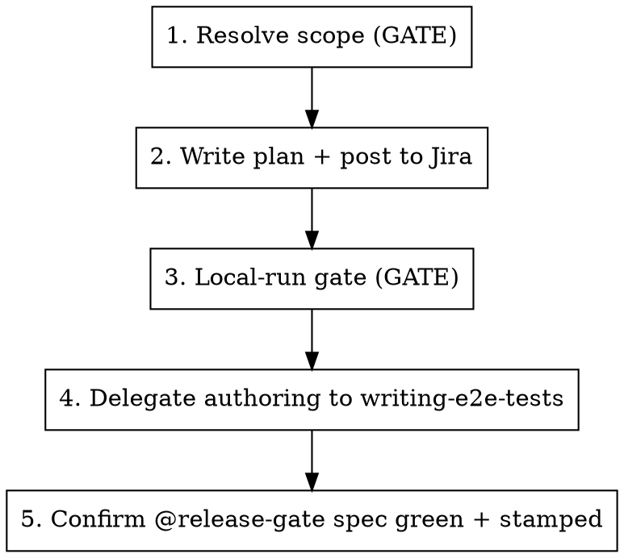

# Explore Feature

This skill produces the two dev-side artifacts of the dev-driven testing workflow: a happy-path
`test-plan.md` (the dev↔QA handoff, posted to Jira) and one staging-ready `@release-gate`
Playwright test committed with the PR. The test gates *that change's own release* and is later
triaged by QA.

It is a **thin orchestrator**: it owns three phases — resolve scope, plan→Jira, stamp+place — and
**delegates the actual test authoring** (analyze FE, discover live UI, write POM/spec, run green)
to the `writing-e2e-tests` skill via a fixed contract.

**Announce at start:** "I'm using the explore-feature skill to build a release-gate test for X."

## What this does — and doesn't

- **Does:** resolve what to gate → write & post the plan → hand `writing-e2e-tests` a staging-ready
  contract → confirm the committed `@release-gate` spec is green locally.
- **Doesn't:** deep bug-hunting or edge-case coverage (that's a separate QA activity); CI wiring
  (staging gate, the move to `shipped/`, age-expiry — not this skill); moving or deleting gate
  tests (the skill only creates/appends).
- **Cheap per-PR happy-path only.** One flow, green locally in minutes.

## The loop



## Phase 1 — Resolve scope (gate)

Normalize whatever the dev pointed at into one **ScopeSpec** before authoring anything.

**Input modes** (auto-detect from the argument; ask if ambiguous):

| Mode | Trigger | Resolve |
|---|---|---|
| Local diff | no arg / dirty tree | `git diff $(git merge-base origin/main HEAD)...HEAD` plus uncommitted changes; ticket from the branch name |
| A PR | `#<n>` or a PR URL | PR diff + linked ticket via `gh pr view <n> --json …` (or the GitHub MCP); detect an existing gate spec to append to |
| Multi-PR / multi-ticket | a list | union of the diffs; the **last** PR is the merge/stamp point |

Produce the **ScopeSpec**:

- `tickets[]` — the lead ticket drives naming; others referenced by key.
- `changedFiles[]` — the FE/BE change surface.
- `targetPath` = `tests_end_to_end/e2e/tests/_release-gate/<lead-ticket>.spec.ts` — new, or existing → append.
- `versionStamp` — see **Version stamp** below.
- `happyPath` — the one end-to-end flow to gate. Multi-PR → the **combined assembled-feature
  flow, as one test** (earlier PRs don't each get a gate).

**Two gates here, before expensive authoring:**

1. **Scope gate** — state the resolved happy path + target path + stamp back to the dev and get a
   yes. Multi-PR especially: "One combined test `<lead>.spec.ts` covering X→Y→Z, stamped
   `<version>`. OK?"
2. **Skip check** — if the change is pure refactor / infra / docs with no user-facing behavior,
   say so, point at the skip label, and stop. This is the escape hatch for the "every user-facing
   PR" policy. Note two cases that *are* user-facing even though they look like config: a
   capability-map / constants change that adds a user-visible option (e.g. a new model in a
   dropdown → happy path: "open the page, the option is selectable"), and a backend-dominant
   change whose only visible effect is subtle (e.g. a trace that should *not* appear in a default
   list) — find the user-observable effect and gate that, don't skip.

### Version stamp

The stamp is the release this PR targets — the next in-development version, read from **trunk**,
not the local tree (a branch can be stale):

```bash
git fetch origin main --quiet
git show origin/main:version.txt   # the stamp
```

- Fetch first (the local `origin/main` ref can be stale). If fetch fails (offline), fall back to
  the cached ref and **warn** the stamp may be behind trunk — never silently use a stale value.
- If the change set itself edits `version.txt` (release PRs), prefer the PR's new value.
- **Append reconciliation:** when appending to an existing gate spec, keep the earliest un-shipped
  `@release-gate:<v>` across the describe block.

## Phase 2 — Write the plan and post it to Jira

- Fill `test-plan-template.md` (read it) from the ScopeSpec.
- Write it to a scratch path (e.g. the session scratchpad) to drive Phase 4. **Never commit it.**
- **Post to Jira, auto with manual fallback:** if the Jira MCP is connected, add the plan as a
  comment on the **lead** ticket (`addCommentToJiraIssue`, `contentFormat=markdown`, **real
  newlines** — a literal `\n` renders as text in ADF). If the MCP isn't connected, print the plan
  and the exact call for the dev to run. Never block on this.
- In any Jira text, use the underscore form (`OPIK_7168`) for tickets this PR does not resolve.

## Phase 3 — Local-run gate

Before authoring can be verified, confirm the dev has a local stack **with their changes**:

1. Probe for a running stack (`http://localhost:5173`, and `:5174` for FE-from-source).
2. **Gate the dev:** confirm the running stack actually contains their changes. A stale prebuilt
   `opik.sh` stack won't show new `data-testid`s — if the feature adds testids, the dev must be on
   FE-from-source `:5174` (`dev-runner --restart`).
3. If nothing is running / it's the wrong stack: offer to spin it (`local-dev` / `dev-runner`) or
   ask the dev to bring it up with their changes, then proceed. Never silently run against a stack
   lacking the feature — that produces false-green or false-missing-testid results.

## Phase 4 — Delegate authoring to `writing-e2e-tests`

Invoke the `writing-e2e-tests` skill to do the analyze → discover-live-UI → write → run-green
loop, handing it the **release-gate authoring contract** (read `release-gate-contract.md` and pass
it verbatim): the target path, the `@release-gate` + `@release-gate:<version>` + feature tags, the
deployment-agnostic requirement, the reuse-or-inline POM policy, and "verify green against the
dev's local stack."

## Phase 5 — Confirm

- The spec exists at `targetPath`, tagged `@release-gate` + `@release-gate:<version>` + a feature
  tag.
- It runs green locally: `cd tests_end_to_end/e2e && npm run test:release-gate`.
- The plan was posted to Jira (or printed for manual posting).
- Report the committed spec path and the Jira comment link back to the dev.

## Ownership

QA owns this skill. When a generated plan or test misses something, the fix lands in this skill's
files — this is the feedback loop. Edit in `.agents/skills/explore-feature/`, then `make claude`
to mirror for local testing.
